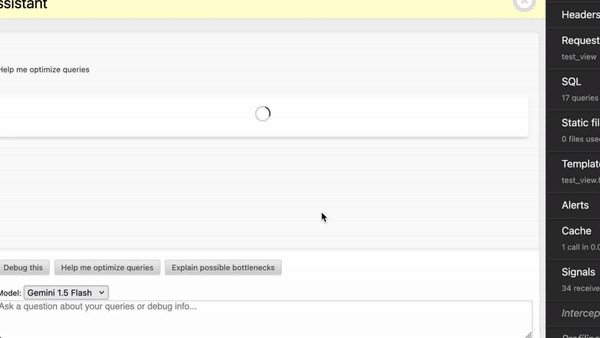

# Django Debug Toolbar Assistant



Chat with Google Gemini in the Django Debug Toolbar.

## Get Started

Install the panel with

```
pip install django-debug-toolbar-assistant
```

Export you Google Gemini API key using

```
GOOGLE_API_KEY="***"
```

Add `django-debug-toolbar-assistant` to your `INSTALLED_APPS`.
